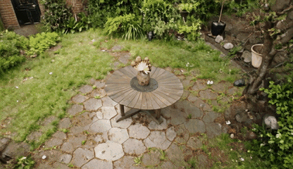

# InSpatio-World


[](https://huggingface.co/inspatio/world-1.5)
[](https://inspatio.github.io/inspatio-world-1.5/)
[](https://github.com/inspatio/inspatio-world/blob/main/LICENSE)
[](https://arxiv.org/abs/2604.07209)
[](https://world.inspatio.com/)

## Examples

| Real-time inference results (single-image input) | Real-time inference results (multi-image input) |
| --- | --- |
|  |  |

The examples show real-time inference results with a single input image (left)
and four input images (right).

## Requirements

- Python 3.10
- CUDA 12.6

**1. Create conda environment:**
```bash
conda env create -f environment.yml
conda activate inspatio_world_test
```

**2. Install Depth Anything 3 for the depth step:**
```bash
python -m pip install --no-deps depth-anything-3==0.1.1
```

`environment.yml` includes the packages DA3 uses on this inference path. The separate command avoids installing its unrelated app and benchmark dependencies.

On Hopper GPUs, we recommend installing FlashAttention-3 (FA3) for faster attention.

## Model Weights

Download the following model checkpoints into the `checkpoints/` directory:

| Model | Purpose | Source |
|---|---|---|
| **InSpatio-World-1.5** | Default v2v checkpoint — 1.3B | [HuggingFace](https://huggingface.co/inspatio/world-1.5) |
| **Wan2.1-T2V-1.3B** | Text encoder, tokenizer, VAE and DiT architecture config | [HuggingFace](https://huggingface.co/Wan-AI/Wan2.1-T2V-1.3B) |
| **DA3 (Depth-Anything-3)** | Depth estimation (Step 1) | [HuggingFace](https://huggingface.co/depth-anything/DA3NESTED-GIANT-LARGE) |

```bash
bash pipeline/download.sh
```

Expected directory structure after downloading:
```
checkpoints/
├── InSpatio-World-1.3B/
│   └── InSpatio-World-1.5-1.3B.safetensors
├── Wan2.1-T2V-1.3B/
└── depth/
```

## Inference

Supported inputs are a single image, four images, or a video. Results are saved to
`output/<output_id>/{source,render,mask,pred}.mp4`.
For image and multi-image data, see [examples/README.md](examples/README.md).

### Run the demo

```bash
bash run_example.sh
```

This runs the six scenes listed in `examples/manifest.json`.

Image and multi-image scenes reuse uint16 depth PNGs. For video, DA3 estimates
both depth and per-frame source camera intrinsics/extrinsics when they are
missing. The target trajectory is still supplied by the user.
Use `--depth_mode existing` to require existing depth, or `--depth_mode estimate`
to regenerate it; the default is `auto`.

### Run your own data

For a video, supply only the RGB video, prompt text, and one target OpenCV
world-to-camera 4×4 matrix per frame (16 row-major numbers per line):

```bash
bash run_inference.sh --video /path/to/input.mp4 \
  --prompt "Your prompt" --target_traj /path/to/target_tcw.txt
```

The runner reads the video's fps and frame count, resizes it to 832×480 if needed,
and estimates depth and per-frame source cameras with DA3. The target trajectory must use
the same first-frame-normalized coordinate system and displacement scale as
the estimated source cameras.

## License

This project is licensed under the [Apache-2.0 License](https://github.com/inspatio/inspatio-world/blob/main/LICENSE). Note that this license only applies to code in our library; dependencies such as [Depth-Anything-3](https://github.com/ByteDance-Seed/depth-anything-3) are separately licensed.

---

## Citation

If you use InSpatio-World in your research, please use the following BibTeX entry.

```bibtex
@misc{inspatio-world,
    title={INSPATIO-WORLD: A Real-Time 4D World Simulator via Spatiotemporal Autoregressive Modeling},
    author={InSpatio Team},
    journal={arXiv preprint arXiv: 2604.07209},
    year={2026}
}
```

## Acknowledgement
InSpatio-World utilizes a backbone based on [Wan2.1](https://github.com/Wan-Video/Wan2.1), with its training code referencing [Self-Forcing](https://github.com/guandeh17/Self-Forcing). We thank the Self-Forcing and Wan teams for their work and open-source contributions. We also acknowledge [Depth-Anything-3](https://github.com/ByteDance-Seed/depth-anything-3) and [ReCamMaster](https://github.com/KlingAIResearch/ReCamMaster) for their contributions.
